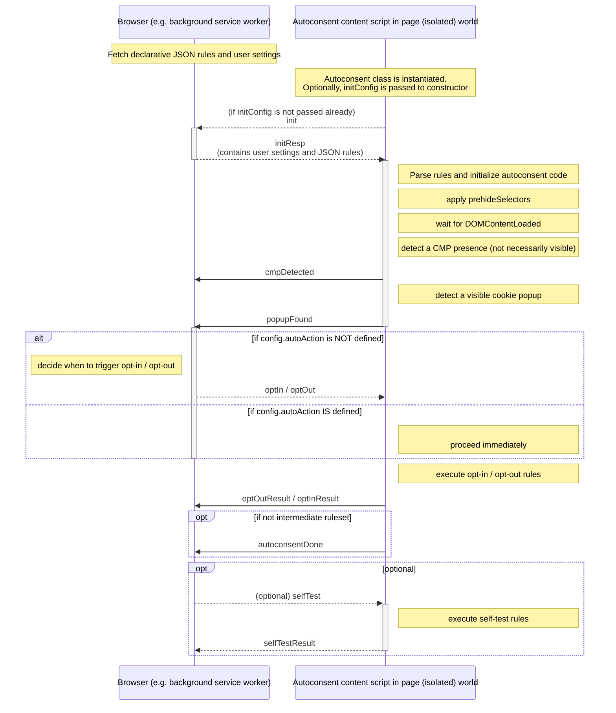
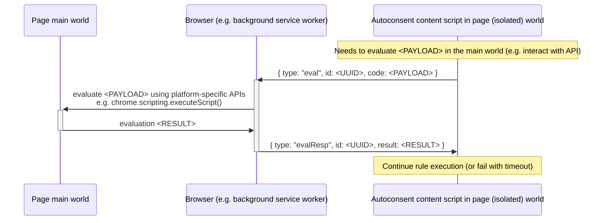

# API

## Content script
Most of autoconsent logic is contained in a content script that should be injected into every page. However, the high-level orchestration is controlled externally by a background service worker (in case of a web extension), or a native browser integration. Autoconsent sends and receives messages to the background worker using provided callables which mimic postMessage API:

```typescript
const consent = new AutoConsent( // make sure not to leak anything to the page globals
    chrome.runtime.sendMessage, // pass a function to send messages to the background worker
    { // optionally, pass a config object
        enabled: true,
        autoAction: 'optOut',
        disabledCmps: [],
        enablePrehide: true,
        detectRetries: 20,
    },
    { // optionally, pass JSON rules
        autoconsent: [ ... ],
        consentomatic: [ ... ],
    }
);

// connect .receiveMessageCallback() to a platform-specific message receiver
chrome.runtime.onMessage.addListener((message: BackgroundMessage) => {
    return Promise.resolve(
        consent.receiveMessageCallback(message)
    );
});
```

## Messaging API

For concrete message format, refer to [messages.ts](/lib/messages.ts).

The overall workflow is described below:



### Asynchronous eval rules

Some rulesets rely on [eval rules](/readme.md#eval) executed in page main context. Since the content script lives in an isolated world, it passes those calls to the more powerful background worker.

**Warning**: eval rules are potentially dangerous and should be avoided when possible.

