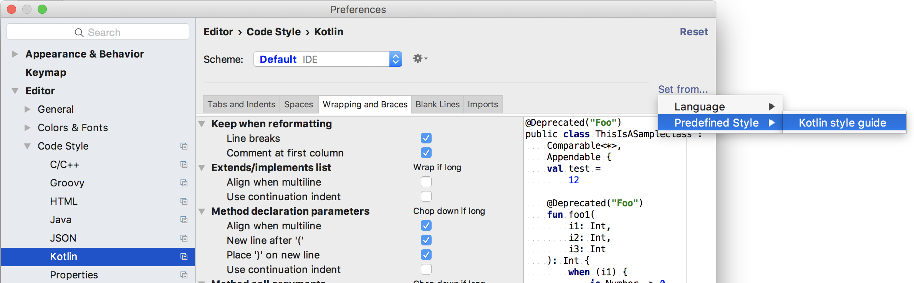
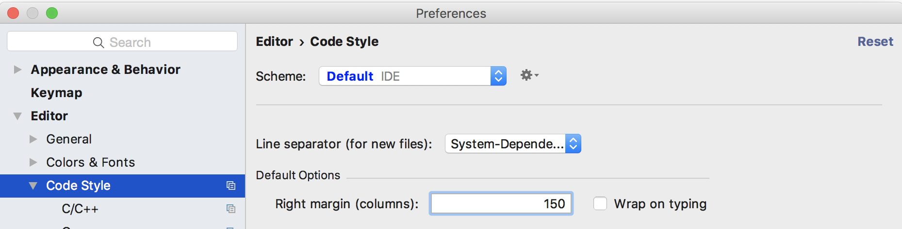

## General
* We care about clean code and aim to make this codebase as self-documenting and readable as possible.
* We primarily use Kotlin and follow the standard coding conventions outlined in https://kotlinlang.org/docs/reference/coding-conventions.html
* There may be instances of code that pre-dates our use of this style guide, these can be refactored as we encounter them.

**IDE Setup:**
* Open Android Studio preferences
* Tap on code style, select Kotlin
* Select Set From, Predefined Style, Kotlin Style Guide


## Line breaks
* We use a line margin of 150 rather than the default of 100 as the default causes excessive line breaks. The larger margin allows us to take advantage of modern widescreen monitors with more screen real-estate.

**IDE Setup:**
* Open android studio preferences
* Tap on code style
* Enter 150 into "Page margin"




## Timber
When logging with Timber we use the new Kotlin styles strings

```Timber.w("Loading $url")```

Rather than C style strings

```Timber.w("Loading %s", url)```

Mixing the two styles within a single statement can lead to crashes so we have standardized on the more readable Kotlin style. This is slightly less efficient - should efficiency become an issue we can use proguard to optimize away log statements for releases.

## Package Names
Case in package names is problematic as some file system and tools do not handle case sensitive file changes well. For this reason, we opt for lowercase packages in our project. Thus we have:

```package com.duckduckgo.app.trackerdetection```

rather than:

```package com.duckduckgo.app.trackerDetection```

## Unit test names
We use the when then convention for test:

```when <condition> then <expected result>```

For example:

```whenUrlIsNotATrackerThenMatchesIsFalse()```
