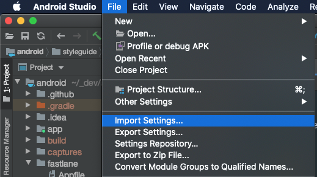
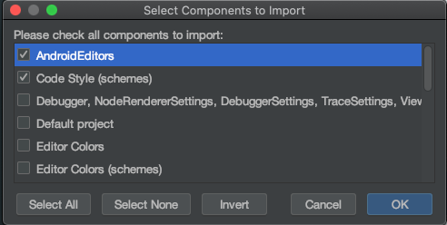
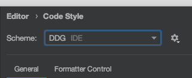

## DuckDuckGo Android Style Guide
* We care about clean code and aim to make this codebase as self-documenting and readable as possible.
* We primarily use Kotlin and follow coding conventions based on the [Android Kotlin Style Guide](https://developer.android.com/kotlin/style-guide)
* There may be instances of code that pre-dates our use of this style guide, these can be refactored as we encounter them.

###  Android Studio Setup

We've provided a coding style that can be imported into Android Studio.
The file can be found [here](ddg-settings.zip).

* From Android Studio click on File -> Import Settings



* Select the file you just downloaded
* Import all components required (AndroidEditors, Code Style and Code Style (schemes))
* 


* Select the new scheme on Android Studio -> Preferences... -> Code style -> Schemes: DDG



##  Code conventions

### Logging
When logging with Timber we use the new Kotlin styles strings

```Timber.w("Loading $url")```

Rather than C style strings

```Timber.w("Loading %s", url)```

Mixing the two styles within a single statement can lead to crashes so we have standardized on the more readable Kotlin style. This is slightly less efficient - should efficiency become an issue we can use proguard to optimize away log statements for releases.

### Package Names
Case in package names is problematic as some file system and tools do not handle case sensitive file changes well. For this reason, we opt for lowercase packages in our project. Thus we have:

```package com.duckduckgo.app.trackerdetection```

rather than:

```package com.duckduckgo.app.trackerDetection```

### Unit test names
We use the when then convention for test:

```when <condition> then <expected result>```

For example:

```whenUrlIsNotATrackerThenMatchesIsFalse()```
