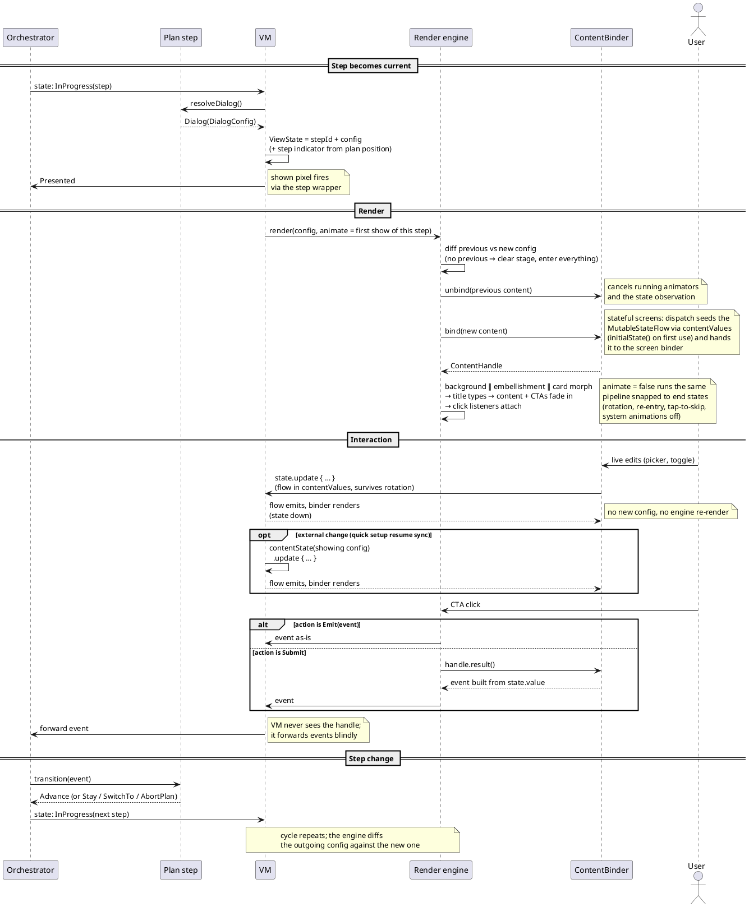

# Onboarding dialog config (v6 — summary)

## Problem

`BrandDesignUpdateWelcomePage` is ~3.1k lines and growing. Three causes:

1. **Every dialog is described twice.** `configureDaxCta` (~720 lines) wires each dialog for
   animated transitions; `showDialogWithoutAnimation` (~620 lines) wires the same dialogs
   again for snapped renders (rotation, re-entry). Every change touches both, and they drift.
2. **Every dialog is modeled three times**:
    ```
    NewUserOnboardingActivityDialog   (step definition, built in the plan provider)
      └─ applyDialog() maps it to →   PreOnboardingDialogType + ~11 scattered ViewState fields
            └─ two when-blocks map that to →   actual views
    ```
3. **Dialogs assume their neighbors.** Branches hardcode what the previous screen left
   behind (which embellishment to dismiss, which animation to exit). Re-ordering screens
   breaks these assumptions one by one.

The Custom AI flow already re-orders screens, and https://app.asana.com/1/137249556945/project/1208671518894266/task/1215556935109578?focus=true will add more
permutations. The current structure makes each one a hand-wired special case.

## Goals

**Goals**
- One `DialogConfig` per screen: pure data (background, embellishment, content, CTAs). The
  step in the plan provider resolves it, the VM forwards it, the renderer draws it. Three representations become one.
- One render engine that diffs previous config against new config. One code path for animated
  and snapped renders, so they cannot drift.
- Any dialog can follow any dialog, or appear from nothing. Re-ordering a flow becomes a
  list edit in the plan provider.

**Non-goals**
- The legacy (non-brand-design) onboarding flow stays as-is, soon to be removed anyway.
- The one-time intro/outro animations and the system dialogs (notifications, default
  browser, add widget). They stay as they are.
- CTAs displayed in `BrowserActivity` stay as they are.

## Strategy

1. Each onboarding step describes its screen as a `DialogConfig`: plain data listing the
background, embellishment, content, and CTAs. The plan provider becomes the single authority
for what each screen shows and in what order.
2. The VM stops translating and just forwards the config.
3. A new render engine compares the previous config with the new one and animates only what
changed — the same code path snaps everything into place when there is nothing to animate
(rotation, re-entry). All the per-dialog view wiring that exists today collapses into that
one engine plus per-screen data.
4. The engine itself is a set of independent axis controllers — background, embellishment, card anchor, content — each seeing only its own previous → next
value.

### `DialogConfig`

```kotlin
data class DialogConfig(
    val background: OnboardingBackgroundStep,   // existing enum, reused as-is
    val embellishment: Embellishment,           // enum: WalkingDax, BobbingDax, BottomWing, LeftWing, None
    val content: ContentConfig,                 // sealed data, described below
    val primaryCta: CtaConfig,
    val secondaryCta: CtaConfig? = null,
    val stepIndicator: StepProgress? = null,    // existing type, filled in by the VM from plan position
)
```

**Config is value-comparable data.** No lambdas, no views. Equality drives the diff, and
  configs are unit-testable straight off the plan.

### `ContentConfig` and `ContentHandle`

`ContentConfig` carries the screen's title plus whatever seed data varies:

```kotlin
sealed interface ContentConfig {
    val title: TextConfig   // every screen has one; rendered by each layout's title view

    // stateless dialogs
    data class Welcome(override val title: TextConfig, val body1: TextConfig, val body2: TextConfig?) : ContentConfig
    data class ComparisonChart(override val title: TextConfig, val config: ComparisonChartConfig) : ContentConfig
    data class AddToDock(override val title: TextConfig) : ContentConfig
    data class WidgetPrompt(override val title: TextConfig) : ContentConfig

    // stateful dialogs
    data class AddressBar(override val title: TextConfig, val initialPosition: OmnibarType, val showSplitOption: Boolean) :
        ContentConfig, Stateful<AddressBarContentState> {
        // ...
    }
    data class InputScreen(override val title: TextConfig, val initialWithAi: Boolean) :
        ContentConfig, Stateful<InputScreenContentState> {
        // ...
    }
    data class InputScreenPreview(override val title: TextConfig, val isSearchDefault: Boolean, val searchSuggestions: List<…>, val chatSuggestions: List<…>) :
        ContentConfig, Stateful<InputScreenPreviewContentState> {
        // ...
    }
    data class QuickSetup(override val title: TextConfig, val hideSetDefaultBrowserRow: Boolean, val hideAddWidgetRow: Boolean, val hideAddressBarRow: Boolean, val isReinstallUser: Boolean) :
        ContentConfig, Stateful<QuickSetupContentState> {
        // ...
    }
}

// stateful screens declare their working state; the engine seeds it at bind
interface Stateful<S : Any> {
    fun initialState(): S
}

data class AddressBarContentState(val position: OmnibarType)
```

View elements, strings, etc. that never vary can stay in the XML as today. Only the title and plan-dependent mutations travel through the config.

The view layer binds a config and hands the engine a small handle. The handle is how a screen
declares its views without re-describing the choreography:

```kotlin
class ContentHandle(
    val title: OnboardingDialogTitleView?,   // engine types content.title into it
    val fadeTargets: List<View>,             // bodies, media, pickers; engine fades them uniformly
    val entrance: (EntranceScope.() -> Unit)? = null, // bespoke intro animations, declared via scope hooks
    val result: (() -> LinearOnboardingEvent)? = null, // stateful screens: builds the submit event from the current selection
    val unbind: () -> Unit = {},             // non-animation resource release; engine cancels scope animators itself
)

interface EntranceScope {
    fun afterFade(animator: () -> Animator)   // runs once the standard fade lands (check-icon stagger, suggestion buttons)
    fun afterTitle(animator: () -> Animator)  // runs once title typing finishes
}
```

The handle is engine-owned, view layer only. The engine attaches the CTA listeners, builds
the event (via `result` for stateful screens), and forwards the finished event to the VM.

**Binders declare animations, never run them.** Bespoke intros go to the engine through
`EntranceScope`, as lazy `() -> Animator` since bind runs before layout. The engine owns
every animator it gets: it plays them at the declared hook, `end()`s them on the snap path
(end values apply even if never started, so binders write one code path) and `cancel()`s
them on unbind. An animator a binder starts itself is out of the engine's reach, so
tap-to-skip and reduced motion break for that screen. Enforced by convention and review.

**Titles.** Every screen layout today copy-pastes the same title machinery: a
`TypeAnimationTextView` for the typing effect, an invisible sizing twin (`hiddenTitleText`)
that keeps the card from resizing while the text types, and `preventWidows` handling (the
non-breaking-space before the last word). That pattern becomes one `OnboardingDialogTitleView` compound
widget, dropped into each layout. The binder sets `content.title` on
it; the rendering engine tells it when to type or snap. No screen re-implements title behavior.

**Stateful screens** (address bar, input screen, quick setup — with more planned as part of the parent project). User edits inside the screen
never produce a new config, they stay local until submitted:

- **Live state.** A stateful screen's working state is one value class in a store owned by
  the VM, one `MutableStateFlow` per screen, keyed by the config class. State flows one way:
  writes go into the store, the binder observes and renders. The engine seeds the flow from
  the config's `initialState()` before bind, and the observation is bind-scoped — the engine
  cancels it at unbind, like animators. A new stateful screen carries its state class, doesn't need a
  new VM field.
  ```
  BrandDesignUpdatePageViewModel
      └─ contentValues: ContentValueStore
  ```
  ```kotlin
  class ContentValueStore {
      private val states = mutableMapOf<KClass<*>, MutableStateFlow<*>>()
      fun <S : Any> contentState(content: Stateful<S>): MutableStateFlow<S>  // seeded from initialState() on first use
  }
  ```
- **Submit.** The binder gives the handle a `result` closure that builds the orchestrator
  event from the screen's state (`{ AddressBarConfirmed(state.value.position) }`).
  The engine's CTA listener fires the closure and forwards the finished event to the VM —
  the VM forwards events blindly and never needs to know which screen is showing.
- **External changes.** Quick setup re-syncs its default-browser and widget switches on
  resume. Same path: the VM writes fresh values through `contentState(…)` on the showing
  screen's config and the bound screen's observation renders them.

Stateful binders are state-down-events-up, so they port to Compose as directly as the
configs do (`collectAsState` plus write-back).

**Binders.** One small binder per screen, holding only its own layout's
binding — it knows how its layout renders its `ContentConfig` and returns the handle:

```kotlin
// view layer — one binder per screen
interface DialogBinder<C : ContentConfig> {
    fun bind(content: C): ContentHandle
}
interface StatefulDialogBinder<C, S : Any> where C : ContentConfig, C : Stateful<S> {
    fun bind(content: C, state: MutableStateFlow<S>): ContentHandle  // state seeded from the config's initialState() before bind
}

// stateless dialog example
class ComparisonChartBinder(private val binding: ViewComparisonChartContentBinding) : DialogBinder<ContentConfig.ComparisonChart> {
    override fun bind(content: ContentConfig.ComparisonChart): ContentHandle = with(binding) {
        populate(content.config)
        ContentHandle(title = titleView, fadeTargets = listOf(comparisonTable), entrance = { afterFade { checkIconStagger() } })
    }
}

// stateful dialog example
class AddressBarBinder(private val binding: ViewAddressBarContentBinding) : StatefulDialogBinder<ContentConfig.AddressBar, AddressBarContentState> {
    override fun bind(content: ContentConfig.AddressBar, state: MutableStateFlow<AddressBarContentState>): ContentHandle = with(binding) {
        picker.onOptionSelected = { position -> state.update { it.copy(position = position) } }  // events up
        observe(state) { picker.selected = it.position }                                         // state down
        ContentHandle(title = titleView, fadeTargets = listOf(picker), result = { AddressBarConfirmed(state.value.position) })
    }
}

class ContentBinder(binding: …, private val contentValues: ContentValueStore) {
    private val welcome = WelcomeBinder(binding.welcomeContent)
    private val comparisonChart = ComparisonChartBinder(binding.comparisonChartContent)
    private val addressBar = AddressBarBinder(binding.addressBarContent)
    // one per screen …

    fun bind(content: ContentConfig): ContentHandle = when (content) {
        is ContentConfig.Welcome -> welcome.bind(content)
        is ContentConfig.ComparisonChart -> comparisonChart.bind(content)
        is ContentConfig.AddressBar -> addressBar.bind(content, contentValues.contentState(content))
        // one line per screen …
    }
}
```

Screen logic can't reach across screens — a binder only sees its own layout, and stateful
binders receive their own, already pre-seeded state flow only.

Adding a screen:
1. Add the `ContentConfig` variant (implementing `Stateful` if it holds
state — the compiler then demands `initialState()`).
2. Add the binder.
3. Add one line to `ContentBinder.bind()`

### Flow

One full step lifecycle, from the step becoming current to the next step taking over:



**Two policies the VM owns explicitly.** `animate` is keyed by step identity: the first render
of a step animates, re-renders (rotation, re-emission) snap. An empty stage — first dialog,
return from `BrowserActivity` — always animates its entrance: one global
policy, replacing today's mixed behaviour where only the comparison chart animates on re-entry
and everything else snaps. The VM is recreated on every activity entry and the orchestrator is
in-memory, so step identity is the only durable signal; the POC validates it suffices.

## Benefits

- ~1.3k lines of duplicated per-dialog wiring become one diff plus per-screen data. Snap and
  animate cannot drift apart.
- Re-ordering or permuting a flow = editing a list. Any ordering animates correctly with no new transition code.
- One owner for running animations: tap-to-skip and view teardown become one call instead of
  hand-enumerating ~25 animators. This pays off even before any re-ordering does.
- `ViewState` collapses from 16 fields to a config and couple of flags.
- `DialogConfig` is the state model a future Compose port would consume unchanged — the
  declarative architecture without the rewrite risk.
- The orchestrator already supports `GoBack` and a diff is direction-agnostic, so backward
  transitions come free if the parent project ever wants back navigation. Enabled, not scoped.

## Risks and mitigations

| Risk | Mitigation |
|---|---|
| Choreography edge cases: embellishments can be vetoed by available space, and they decide the card's anchoring; one screen depends on anchor timing during the previous embellishment's exit | Owned by one `EmbellishmentController` (fit veto + anchoring) plus a general engine rule: hold the card anchor until the exiting embellishment finishes. The fit veto re-runs per frame, so declared config ≠ actual stage — the controller is sole owner of declared-vs-actual reconciliation; the engine diffs declared values only and delegates. A thin POC of the welcome → comparison → address-bar chain de-risks all of this first |
| Shown pixels silently stop firing | Shown pixels fire when the orchestrator receives a `Presented` event, and today that event is sent from code this design deletes; the VM fires it explicitly per step instead. Legacy `PREONBOARDING_*_SHOWN_UNIQUE` pixels are moved onto steps or confirmed superseded before the old path goes |
| Regression in a release-critical flow | Whole parallel renderer behind a remote toggle (see Rollout): the flag-off arm stays byte-identical, mixed-renderer sessions never exist, and the kill switch needs no release. Maestro release-blocker flows run in both flag states, plus unit tests off the resolver |
| Two consecutive steps resolve identical configs, `StateFlow` swallows the second | Emitted state is keyed by step id, not config equality alone |
| Engine grows dialog-specific logic over time | Hard rules: bespoke behaviour goes into the screen's content config or its handle, never into the engine; and no code branches on (previous, next) screen pairs — each axis controller sees only its own axis |

## Rollout

Behind a remote feature flag from day one: a new toggle on the existing
`OnboardingBrandDesignUpdateToggles` (e.g. `configDrivenDialogs()`, default INTERNAL). The flag
selects a whole parallel renderer, not per-screen paths.
`OnboardingPageManager`/`OnboardingPageBuilder` already choose between welcome-page fragments
(legacy vs brand-design); the toggle adds one more branch at that seam — a new config-driven
fragment when on, the existing `BrandDesignUpdateWelcomePage` untouched when off. Mixed-renderer
sessions never exist, so no legacy screen ever follows an engine-rendered one (which would trip
exactly the neighbor assumptions this design deletes), and the flag-off arm stays byte-identical
throughout. The remote toggle doubles as a no-release kill switch.

Shared vs duplicated while both arms exist:

- **Orchestrator and plan provider: untouched.** Steps keep returning
  `NewUserOnboardingActivityDialog`; the new path adds one pure `DialogConfigResolver` (a single
  `when` mapping dialog → `DialogConfig`) — the unit-testable config source immediately, inlined
  into the steps at cleanup. That is when "plan provider is the single authority" lands; until
  then neither the plan nor the legacy VM sees the flag.
- **Layouts: shared.** The new fragment inflates the same card and includes. One exception:
  the `OnboardingDialogTitleView` widget changes include internals, so that refactor happens
  in place first, with legacy binding through it — the single legacy edit of the rollout.
- **New slim VM.** Config + two flags + `ContentValueStore`. The shown-pixel map (~15 lines) is
  duplicated into it and dies with legacy — both arms emit identical pixel names, so ramp arms
  are directly comparable. Command handling for the command-only steps ports as-is; the
  quick-setup syncs become VM writes into the content-value store.

Sequence:

1. `OnboardingDialogTitleView` include refactor in place (only legacy edit; ships alone).
2. Dark scaffolding: `DialogConfig` types + resolver + engine + binder + new fragment/VM behind
   the flag at INTERNAL. The POC chain (welcome → comparison → address-bar) exercises every
   risky mechanism in one pass on internal builds before anything else is built.
3. Remaining screens, one dark PR each — any order; no coexistence constraints.
4. Gate: Maestro release-blocker flows run in both flag states; unit tests assert configs
   straight off the resolver.
5. Ramp as an experiment with pixel parity between arms; kill switch armed.
6. 100% plus one release of soak → delete the legacy fragment, VM, when-blocks, and
   `PreOnboardingDialogType` (including the dead `SKIP_ONBOARDING_OPTION`, never produced by
   this VM) and dead `ViewState` fields (`isReinstallUser` is write-only today — audit whether
   `QuickSetup` needs the flag at all); inline the resolver into the steps; retire the flag.

Trade-off, named: nothing user-visible ships until every screen renders in the new path.
Bounded — 8 binder branches plus the engine; screens still land as small continuous dark PRs,
not a long-lived branch. Incremental user-visible shipping was the in-place strangler's only
advantage, and it bought mixed-renderer coexistence to get it.
