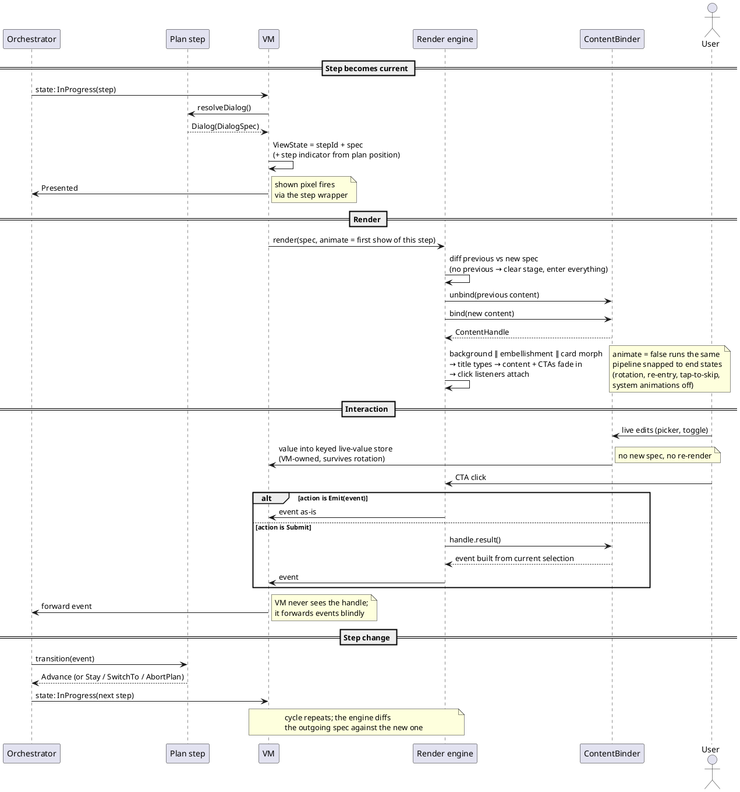

# Onboarding dialog spec (v6 — summary)

## Problem

`BrandDesignUpdateWelcomePage` is ~3.1k lines and growing. Three causes:

1. **Every dialog is described twice.** `configureDaxCta` (~720 lines) wires each dialog for
   animated transitions; `showDialogWithoutAnimation` (~620 lines) wires the same dialogs
   again for snapped renders (rotation, re-entry). Every change touches both, and they drift.
2. **Every dialog is modeled three times**:
    ```
    NewUserOnboardingActivityDialog   (step render intent, built in the plan provider)
      └─ applyDialog() maps it to →   PreOnboardingDialogType + ~11 scattered ViewState fields
            └─ two when-blocks map that to →   actual views
    ```
3. **Dialogs assume their neighbors.** Branches hardcode what the previous screen left
   behind (which embellishment to dismiss, which animation to exit). Re-ordering screens
   breaks these assumptions one by one.

The Custom AI flow already re-orders screens, and the parent project will add more
permutations. The current structure makes each one a hand-wired special case.

## Goals

**Goals**
- One `DialogSpec` per screen: pure data (background, embellishment, content, CTAs). The
  step in the plan provider resolves it, the VM forwards it, the renderer draws it. Three representations become one.
- One render engine that diffs previous spec against new spec. One code path for animated
  and snapped renders, so they cannot drift.
- Any dialog can follow any dialog, or appear from nothing. Re-ordering a flow becomes a
  list edit in the plan provider.

**Non-goals**
- The legacy (non-brand-design) onboarding flow stays as-is, soon to be removed anyway.
- The one-time intro/outro animations and the system dialogs (notifications, default
  browser, add widget). They stay as they are.
- CTAs displayed in `BrowserActivity` stay as they are.

## Strategy

Each onboarding step describes its screen as a `DialogSpec`: plain data listing the
background, embellishment, content, and CTAs. The plan provider becomes the single authority
for what each screen shows and in what order. The VM stops translating and just forwards the
spec. A new render engine compares the previous spec with the new one and animates only what
changed — the same code path snaps everything into place when there is nothing to animate
(rotation, re-entry). All the per-dialog view wiring that exists today collapses into that
one engine plus per-screen data. The engine itself is a set of independent axis controllers —
background, embellishment, card anchor, content — each seeing only its own previous → next
value. Nothing branches on a (previous screen, next screen) pair; that single rule is what
keeps N screens at N transition costs instead of resurrecting the N×N matrix.

### `DialogSpec`

```kotlin
data class DialogSpec(
    val background: OnboardingBackgroundStep,   // existing enum, reused as-is
    val embellishment: Embellishment,           // enum: WalkingDax, BobbingDax, BottomWing, LeftWing, None
    val content: ContentSpec,                   // sealed data, below; carries the screen's title and variable elements
    val primaryCta: CtaSpec,
    val secondaryCta: CtaSpec? = null,
    val stepIndicator: StepProgress? = null,    // existing type, filled in by the VM from plan position
)
```

**Spec is value-comparable data.** No lambdas, no views. Equality drives the diff, and
  specs are unit-testable straight off the plan.

### `ContentSpec` and `ContentHandle`

`ContentSpec` carries the screen's title plus whatever seed data varies:

```kotlin
sealed interface ContentSpec {
    val title: TextSpec   // every screen has one; rendered by its include's title view

    // stateless
    data class Welcome(override val title: TextSpec, val body1: TextSpec, val body2: TextSpec?) : ContentSpec
    data class ComparisonChart(override val title: TextSpec, val config: ComparisonChartConfig) : ContentSpec
    data class AddToDock(override val title: TextSpec) : ContentSpec
    data class WidgetPrompt(override val title: TextSpec) : ContentSpec

    // stateful: seed in, live edits mirror into a plain VM field, submit event built from the current selection
    data class AddressBar(override val title: TextSpec, val initialPosition: OmnibarType, val showSplitOption: Boolean) : ContentSpec
    data class InputScreen(override val title: TextSpec, val initialWithAi: Boolean) : ContentSpec
    data class InputScreenPreview(override val title: TextSpec, val isSearchDefault: Boolean, val searchSuggestions: List<…>, val chatSuggestions: List<…>) : ContentSpec
    data class QuickSetup(override val title: TextSpec, val hideSetDefaultBrowserRow: Boolean, val hideAddWidgetRow: Boolean, val hideAddressBarRow: Boolean, val isReinstallUser: Boolean) : ContentSpec
}
```

View elements, strings, etc. that never vary stay in the include's XML or in
the binder, as today. Only the title and plan-dependent copy travel through the spec.
`title` stays non-null while every screen has one; if a titleless screen ever appears,
making it nullable (engine skips the typing stage) is a one-line change — deliberately
not pre-built.

The view layer binds a spec and hands the engine a small handle. The handle is how a screen
declares its views without re-describing the choreography:

```kotlin
class ContentHandle(
    val title: OnboardingDialogTitleView?,   // engine types content.title into it
    val fadeTargets: List<View>,             // bodies, media, pickers; engine fades them uniformly
    val intro: Animator? = null,             // bespoke extras only (check-icon stagger, suggestion buttons)
    val result: (() -> LinearOnboardingEvent)? = null, // stateful screens: builds the submit event from the current selection
    val unbind: () -> Unit = {},             // resource release, animation cancels
)
```

The handle is engine-owned, view layer only. The VM never sees it: a handle captures views,
so a VM-held handle would go stale on rotation. The engine attaches the CTA listeners, builds
the event (via `result` for stateful screens), and forwards the finished event to the VM.
`result` is typed against the orchestrator-core `LinearOnboardingEvent`, not the new-user
event type, so the engine stays flow-agnostic.

**Titles.** Every screen layout today copy-pastes the same title machinery: a
`TypeAnimationTextView` for the typing effect, an invisible sizing twin (`hiddenTitleText`)
that keeps the card from resizing while the text types, and `preventWidows` handling (the
U+00A0 before the last word). That pattern becomes one `OnboardingDialogTitleView` compound
widget, dropped into each layout. The binder sets `content.title` on
it; the rendering engine tells it when to type or snap. No screen re-implements title behavior.

**Stateful screens** (address bar, input screen, quick setup — with more planned as the next
step of this initiative). User edits inside the screen
never produce a new spec, so the engine only diffs on real step changes. No holder object is
needed — two existing mechanisms cover it:

- **Live value.** The view writes edits into a small typed key-value store owned by the VM
  (`viewModel.liveValues[AddressBarPosition] = it`). It is not render state, so nothing
  re-renders; it survives rotation because the VM does, and the binder seeds the picker from
  it, falling back to the spec's initial value. The VM never reads the store — it just owns
  it. Adding a stateful screen means a new key, not a new VM field, so the pattern stays
  constant-cost as screens are added.
- **Submit.** The binder gives the handle a `result` closure that builds the orchestrator
  event directly from the current selection (`{ AddressBarConfirmed(picker.selected) }`).
  The engine's CTA listener fires the closure and forwards the finished event to the VM —
  the VM forwards events blindly and never needs to know which screen is showing.
- **External changes.** Some content mirrors system state that changes mid-step: quick setup
  re-syncs its default-browser and widget switches on resume. That stays on the existing
  `Command` channel, which this design leaves untouched — the command handler pokes the
  bound view (via an optional update hook on the handle). Not render state, no new spec.

If a future screen's live state needs to influence *other* steps before submit, the store
is not the tool: that value should travel through an orchestrator event into the plan's
context (existing precedent: the pending Duck.ai prompt). Escape valve, not the default.

**The binder** is the only place that knows which layout include belongs to which
`ContentSpec`. It sets the spec's data on the views and returns the handle:

```kotlin
// view layer
class ContentBinder(private val binding: …) {
    fun bind(content: ContentSpec): ContentHandle = when (content) {
        is ContentSpec.Welcome -> with(binding.welcomeContent) {
            body1.text = content.body1.resolve()
            content.body2?.let { body2.text = it.resolve() }
            ContentHandle(title = titleView, fadeTargets = listOfNotNull(body1, content.body2?.let { body2 }))
        }
        is ContentSpec.ComparisonChart -> with(binding.comparisonChartContent) {
            populate(content.config)
            ContentHandle(title = titleView, fadeTargets = listOf(comparisonTable), intro = checkIconStagger())
        }
        is ContentSpec.AddressBar -> with(binding.addressBarContent) {
            picker.selected = viewModel.liveValues[AddressBarPosition] ?: content.initialPosition
            picker.onOptionSelected = { viewModel.liveValues[AddressBarPosition] = it }  // survives rotation
            ContentHandle(title = titleView, fadeTargets = listOf(picker), result = { AddressBarConfirmed(picker.selected) })
        }
        is ContentSpec.AddToDock -> with(binding.addToDockContent) {
            ContentHandle(title = titleView, fadeTargets = listOf(body, video), unbind = { releaseVideo() })
        }
        // one branch per screen …
    }
}
```

### Flow

One full step lifecycle, from the step becoming current to the next step taking over:



**Two policies the VM owns explicitly.** `animate` is keyed by step identity: the first render
of a step animates, re-renders (rotation, re-emission) snap. An empty stage — first dialog,
return from `BrowserActivity`, migration handoff — always animates its entrance: one global
policy, replacing today's mixed behaviour where only the comparison chart animates on re-entry
and everything else snaps. The VM is recreated on every activity entry and the orchestrator is
in-memory, so step identity is the only durable signal; the POC validates it suffices.

## Benefits

- ~1.3k lines of duplicated per-dialog wiring become one diff plus per-screen data. Snap and
  animate cannot drift apart.
- Re-ordering or permuting a flow = editing a list. Step indicator renumbers itself; any
  ordering animates correctly with no new transition code.
- New bubble screen = defining (reusing) a layout and providing variables. No need for ~200 lines duplicated across two when-blocks for plumbing.
- One owner for running animations: tap-to-skip and view teardown become one call instead of
  hand-enumerating ~25 animators. This pays off even before any re-ordering does.
- Every dialog can enter from an empty stage. "No previous spec" means clear the stage
  and enter — not a special case. This covers the first dialog, returns from
  `BrowserActivity` (today a hand-coded comparison-chart path), and migration handoffs.
- `ViewState` collapses from 16 fields (one already write-only dead) to a spec and two flags;
  the VM's dialog switch reduces to five branches — the four command-only steps (intro
  animation, notification permission, default browser, add widget) plus one for every
  spec-rendered dialog.
- `DialogSpec` is the state model a future Compose port would consume unchanged — the
  declarative architecture without the rewrite risk.
- One place to honor system animation settings: animations-off routes the whole pipeline
  through its snapped path. Today nothing in this flow respects reduced motion.
- The orchestrator already supports `GoBack` and a diff is direction-agnostic, so backward
  transitions come free if the parent project ever wants back navigation. Enabled, not scoped.

## Risks and mitigations

| Risk | Mitigation |
|---|---|
| Choreography edge cases: embellishments can be vetoed by available space, and they decide the card's anchoring; one screen depends on anchor timing during the previous embellishment's exit | Owned by one `EmbellishmentController` (fit veto + anchoring) plus a general engine rule: hold the card anchor until the exiting embellishment finishes. The fit veto re-runs per frame, so declared spec ≠ actual stage — the controller is sole owner of declared-vs-actual reconciliation; the engine diffs declared values only and delegates. A thin POC of the welcome → comparison → address-bar chain de-risks all of this first |
| Shown pixels silently stop firing | Shown pixels fire when the orchestrator receives a `Presented` event, and today that event is sent from code this design deletes; the VM fires it explicitly per step instead. Legacy `PREONBOARDING_*_SHOWN_UNIQUE` pixels are moved onto steps or confirmed superseded before the old path goes |
| Regression in a release-critical flow | Strangler migration: one dialog at a time, each step shippable and revertible, legacy and new renderer coexist (legacy stays authoritative for unmigrated screens; the engine clears the stage when taking over). Maestro release-blocker flows plus unit tests gate every step |
| Two consecutive steps resolve identical specs, `StateFlow` swallows the second | Emitted state is keyed by step id, not spec equality alone |
| Engine grows dialog-specific logic over time | Hard rules: bespoke behaviour goes into the screen's content spec or its handle, never into the engine; and no code branches on (previous, next) screen pairs — each axis controller sees only its own axis |

## Rollout

Scaffolding first (pure data types + engine, no behaviour change), then migrate screens
simplest-first, then delete the legacy when-blocks, `PreOnboardingDialogType` (including the
dead `SKIP_ONBOARDING_OPTION`, never produced by this VM), and dead `ViewState` fields
(`isReinstallUser` is write-only today — audit during migration whether `QuickSetup` needs
the flag at all). POC before committing: the three-screen chain above exercises every
risky mechanism in one pass.
