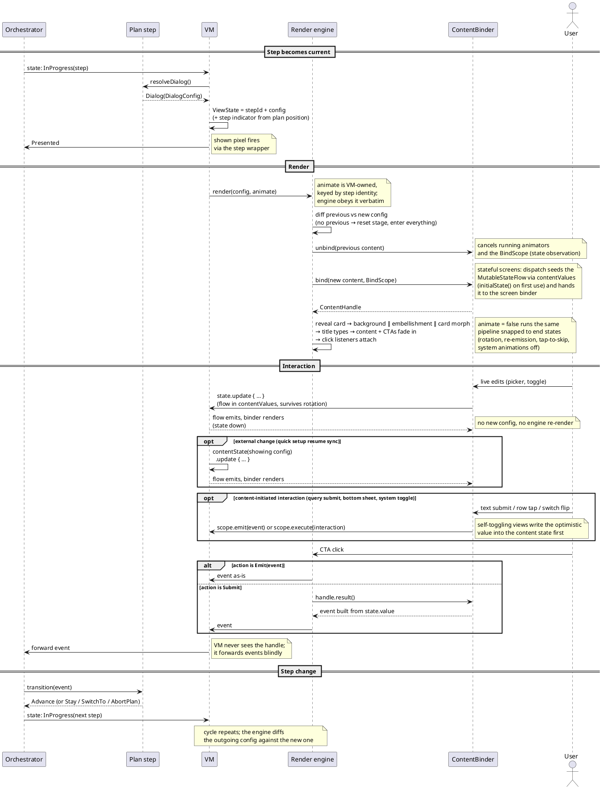

# Onboarding dialog config (v7 — summary)

Supersedes v6 (`temp-docs/2026-07-09-onboarding-dialog-spec-design-v6-summary.md`). The design is
now implemented end to end behind the `configDrivenDialogs()` toggle (default INTERNAL) and
device-debugged; v7 folds the spec-level learnings from that work back into the design. POC
details and verification: `temp-docs/plans/2026-07-23-config-driven-dialog-poc-results.md`.

## Changes from v6

1. `BindScope` + `ContentInteraction`: content-initiated interactions (query submit, bottom
   sheets, system dialogs) that `ContentHandle` alone could not express.
2. `primaryCta` is nullable — the input screen preview has no primary CTA.
3. `showCardArrow` + `cardArrowAtEnd` are `DialogConfig` fields — arrow visibility and position
   are screen data, applied synchronously at render.
4. `TextConfig` gains an `html` flag — replaces the binder inferring html-decoding from `body2 == null`.
5. `QuickSetup.isReinstallUser` dropped (dead — legacy never renders on it either); content
   shapes aligned with the implementation.
6. Animate policy codified: the VM owns `animate` outright, the engine obeys it verbatim; the
   empty-stage rule is expressed through VM lifetime, not an engine policy.
7. Animator-ownership sharp edges stated (self-removing tracked lists, `start()`-then-`end()`
   on the snap path, enter-parallel-to-exit).
8. Optimistic-state mirroring rule for stateful screens with self-toggling views.
9. New "whole-stage choreography" section — the screen-agnostic behaviors owned by no single
   dialog, which produced nearly every device bug in the POC.
10. Risks and rollout updated to POC status: anchored card bias is per-decoration data; design
    sign-off narrowed to the unanchored-tablet bias normalization.

## Problem

`BrandDesignUpdateWelcomePage` is ~3.1k lines and growing. This becomes unmanageable. Three causes:

1. **Every dialog is described twice.** `configureDaxCta` (~720 lines) wires each dialog for
   animated transitions; `showDialogWithoutAnimation` (~620 lines) wires the same dialogs
   again for snapped renders (rotation, re-entry). Every change touches both, and they drift.
2. **Every dialog is modeled three times**:
    ```
    NewUserOnboardingActivityDialog   (step definition, built in the plan provider)
      └─ applyDialog() maps it to →   PreOnboardingDialogType + ~11 scattered ViewState fields
            └─ two when-blocks map that to →   actual views
    ```
3. **Dialogs assume their neighbors.** Branches hardcode what the previous screen left
   behind (which embellishment to dismiss, which animation to exit). Re-ordering screens
   breaks these assumptions one by one.

The Custom AI flow already re-orders screens, and https://app.asana.com/1/137249556945/project/1208671518894266/task/1215556935109578?focus=true will add more
permutations. The current structure makes each one a hand-wired special case.

## Goals

**Goals**
- One `DialogConfig` per screen: pure data (background, embellishment, content, CTAs). The
  step in the plan provider resolves it, the VM forwards it, the renderer draws it. Three representations become one.
- One render engine that diffs previous config against new config. One code path for animated
  and snapped renders, so they cannot drift.
- Any dialog can follow any dialog, or appear from nothing. Re-ordering a flow becomes a
  list edit in the plan provider.

**Non-goals**
- The legacy (non-brand-design) onboarding flow stays as-is, soon to be removed anyway.
- The one-time intro/outro animations and the system dialogs (notifications, default
  browser, add widget). They stay as they are.
- CTAs displayed in `BrowserActivity` stay as they are.

## Strategy

1. Each onboarding step describes its screen as a `DialogConfig`: plain data listing the
background, embellishment, content, and CTAs. The plan provider becomes the single authority
for what each screen shows and in what order.
2. The VM stops translating and just forwards the config.
3. A new render engine compares the previous config with the new one and animates only what
changed — the same code path snaps everything into place when there is nothing to animate
(rotation, re-entry). All the per-dialog view wiring that exists today collapses into that
one engine plus per-screen data.
4. The engine itself is a set of independent axis controllers — background, embellishment, card anchor, content — each seeing only its own previous → next
value.

### `DialogConfig`

```kotlin
data class DialogConfig(
    val background: OnboardingBackgroundStep,   // existing enum, reused as-is
    val embellishment: Embellishment,           // enum: WalkingDax, BobbingDax, BottomWing, LeftWing, None
    val content: ContentConfig,                 // sealed data, described below
    val primaryCta: CtaConfig?,                 // null when the screen progresses without one (preview submits a query)
    val secondaryCta: CtaConfig? = null,
    val stepIndicator: StepProgress? = null,    // existing type, filled in by the VM from plan position
    val showCardArrow: Boolean = true,          // false on the input screen preview
    val cardArrowAtEnd: Boolean = true,         // false only on welcome (arrow stays at its XML start offset)
)
```

**Config is value-comparable data.** No lambdas, no views. Equality drives the diff, and
  configs are unit-testable straight off the plan.

**The card arrow is config, not choreography.** Device testing showed both arrow fields must
apply synchronously at render — riding the (possibly deferred) embellishment settle leaves the
arrow visible seconds too long and on the wrong side of the card. The engine applies both
directly and diffs `cardArrowAtEnd`: on the one transition where it changes (welcome → next),
the diff drives a tracked 400ms slide across the card.

### `ContentConfig` and `ContentHandle`

`ContentConfig` carries the screen's title plus whatever seed data varies:

```kotlin
sealed interface ContentConfig {
    val title: TextConfig   // every screen has one; rendered by each layout's title view

    // stateless dialogs
    data class Welcome(override val title: TextConfig, val body1: TextConfig, val body2: TextConfig?) : ContentConfig
    data class ComparisonChart(override val title: TextConfig, val config: ComparisonChartConfig) : ContentConfig
    data class AddToDock(override val title: TextConfig, val body: TextConfig) : ContentConfig
    data class WidgetPrompt(override val title: TextConfig, val body: TextConfig) : ContentConfig

    // stateful dialogs
    data class AddressBar(override val title: TextConfig, val initialPosition: OmnibarType, val showSplitOption: Boolean) :
        ContentConfig, Stateful<AddressBarContentState> {
        // ...
    }
    data class InputScreen(override val title: TextConfig, val description: TextConfig, val initialWithAi: Boolean) :
        ContentConfig, Stateful<InputScreenContentState> {
        // ...
    }
    data class InputScreenPreview(override val title: TextConfig, val isSearchDefault: Boolean, val showModeToggle: Boolean, val searchSuggestions: List<…>, val chatSuggestions: List<…>) :
        ContentConfig, Stateful<InputScreenPreviewContentState> {
        // ...
    }
    data class QuickSetup(override val title: TextConfig, val showSplitOption: Boolean, val hideSetDefaultBrowserRow: Boolean, val hideAddWidgetRow: Boolean, val hideAddressBarRow: Boolean, val initialAddressBarPosition: OmnibarType, val initialWithAi: Boolean) :
        ContentConfig, Stateful<QuickSetupContentState> {
        // ...
    }
}

// stateful screens declare their working state; the engine seeds it at bind
interface Stateful<S : Any> {
    fun initialState(): S
}

data class AddressBarContentState(val position: OmnibarType)
```

View elements, strings, etc. that never vary can stay in the XML as today. Only the title and plan-dependent mutations travel through the config.

`TextConfig` resolves a resource or a literal, plus one flag:

```kotlin
sealed interface TextConfig {
    val html: Boolean   // default false; the binder html-decodes the resolved text when set

    data class Resource(@StringRes val resId: Int, override val html: Boolean = false) : TextConfig
    data class Literal(val text: String, override val html: Boolean = false) : TextConfig
}
```

Legacy html-decodes the welcome body only in the sync-restore and custom-AI flows. The POC
binder inferred that from `body2 == null`, which works but hides the intent — the flag makes
it plan data like everything else.

The view layer binds a config and hands the engine a small handle. The handle is how a screen
declares its views without re-describing the choreography:

```kotlin
class ContentHandle(
    val title: OnboardingDialogTitleView?,   // engine types content.title into it
    val fadeTargets: List<View>,             // bodies, media, pickers; engine fades them uniformly
    val entrance: (EntranceScope.() -> Unit)? = null, // bespoke intro animations, declared via scope hooks
    val result: (() -> NewUserOnboardingEvent)? = null, // stateful screens: builds the submit event from the current selection
    val unbind: () -> Unit = {},             // non-animation resource release; engine cancels scope animators itself
)

interface EntranceScope {
    fun afterFade(animator: () -> Animator)   // runs once the standard fade lands (check-icon stagger, suggestion buttons)
    fun afterTitle(animator: () -> Animator)  // runs once title typing finishes
}
```

The handle covers everything CTA-driven, but the POC showed it is not enough on its own:
the input screen preview submits queries from its text input (no CTA involved), and quick
setup opens bottom sheets and system dialogs from rows and switches. Those are
content-initiated, so bind also receives a `BindScope`:

```kotlin
class BindScope(
    val coroutineScope: CoroutineScope,          // engine cancels it at unbind (state observation lives here)
    val emit: (NewUserOnboardingEvent) -> Unit,  // content-initiated orchestrator events (query submit)
    val execute: (ContentInteraction) -> Unit,   // content-initiated VM interactions (bottom sheets, toggles)
)

// the VM interactions a bound screen can trigger outside the shared CTA flow
sealed interface ContentInteraction {
    data object EditAddressBarPosition : ContentInteraction
    data object EditSearchOptions : ContentInteraction
    data class SetDefaultBrowserToggled(val checked: Boolean) : ContentInteraction
    data class AddWidgetToggled(val checked: Boolean) : ContentInteraction
}
```

The handle and scope are engine-owned, view layer only. The engine attaches the CTA listeners
(when `primaryCta` is present), builds the event (via `result` for stateful screens), and
forwards the finished event to the VM. `emit`/`execute` go through the same VM funnel — the
VM still forwards blindly.

**Binders declare animations, never run them.** Bespoke intros go to the engine through
`EntranceScope`, as lazy `() -> Animator` since bind runs before layout. The engine owns
every animator it gets: it plays them at the declared hook, ends them on the snap path and
`cancel()`s them on unbind. An animator a binder starts itself is out of the engine's reach, so
tap-to-skip and reduced motion break for that screen. Enforced by convention and review.

**Animator ownership has sharp edges the engine must respect** (all found on device):

- Tracked animator lists self-remove entries on natural completion. `end()` on an
  already-finished animator *restarts* it and re-fires its `onAnimationStart` listeners —
  which is how a settled-stage tap could replay a Lottie decoration.
- `AnimatorSet.end()` is a no-op while unstarted (unlike `ValueAnimator.end()`, which
  self-starts). The snap path therefore `start()`s then `end()`s each entrance animator —
  otherwise snapped renders leave entrance targets invisible but clickable.
- A decoration's enter runs in parallel with its predecessor's exit. Only the card re-anchor
  defers to exit completion (the hold-anchor rule below) — serializing the whole enter behind
  a multi-second Lottie dismiss visibly desynchronizes the stage.
- The card `ChangeBounds` morph is the one choreography piece outside `Animator` ownership:
  a mid-morph skip settles content but not the bounds tween, and a same-frame double render
  can strand a continuation (self-recovers on the next render or skip). Documented limitation.

**Titles.** Every screen layout today copy-pastes the same title machinery: a
`TypeAnimationTextView` for the typing effect, an invisible sizing twin (`hiddenTitleText`)
that keeps the card from resizing while the text types, and `preventWidows` handling (the
non-breaking-space before the last word). That pattern becomes one `OnboardingDialogTitleView` compound
widget, dropped into each layout. The binder sets `content.title` on
it; the rendering engine tells it when to type or snap. No screen re-implements title behavior.
(The POC bridges with a `DialogTitleController` over the existing include views; the in-place
compound-widget refactor is still planned before cleanup.)

**Stateful screens** (address bar, input screen, quick setup — with more planned as part of the parent project). User edits inside the screen
never produce a new config, they stay local until submitted:

- **Live state.** A stateful screen's working state is one value class in a store owned by
  the VM, one `MutableStateFlow` per screen, keyed by the config class. State flows one way:
  writes go into the store, the binder observes and renders. The engine seeds the flow from
  the config's `initialState()` before bind, and the observation is bind-scoped — it lives in
  the `BindScope`'s coroutine scope, which the engine cancels at unbind, like animators. A new
  stateful screen carries its state class, doesn't need a new VM field. (Keying by config class
  assumes each stateful screen appears at most once per plan run — true for every current flow;
  revisit if a plan ever repeats a screen.)
  ```
  BrandDesignUpdatePageViewModel
      └─ contentValues: ContentValueStore
  ```
  ```kotlin
  class ContentValueStore {
      private val states = mutableMapOf<KClass<*>, MutableStateFlow<*>>()
      fun <S : Any> contentState(content: Stateful<S>): MutableStateFlow<S>  // seeded from initialState() on first use
  }
  ```
- **Submit.** The binder gives the handle a `result` closure that builds the orchestrator
  event from the screen's state (`{ AddressBarConfirmed(state.value.position) }`).
  The engine's CTA listener fires the closure and forwards the finished event to the VM —
  the VM forwards events blindly and never needs to know which screen is showing.
- **External changes.** Quick setup re-syncs its default-browser and widget switches on
  resume. Same path: the VM writes fresh values through `contentState(…)` on the showing
  screen's config and the bound screen's observation renders them.
- **Optimistic views mirror into the store at event time.** Rule: the store always reflects
  what the view currently shows. A switch flips itself before its event reaches the VM; if the
  store only records confirmed outcomes, a corrective write of the unchanged value equals the
  stored value, the `MutableStateFlow` dedupes it, and the binder never renders the revert
  (found on device: the default-browser toggle stuck ON after declining the system dialog).
  So a self-toggling view's interaction writes the optimistic value into the content state
  first, then runs its side effect; the resume sync corrects it if the outcome differs.

Stateful binders are state-down-events-up, so they port to Compose as directly as the
configs do (`collectAsState` plus write-back).

**Binders.** One small binder per screen, holding only its own layout's
binding — it knows how its layout renders its `ContentConfig` and returns the handle:

```kotlin
// view layer — one binder per screen
interface DialogBinder<C : ContentConfig> {
    fun bind(content: C, scope: BindScope): ContentHandle
}
interface StatefulDialogBinder<C, S : Any> where C : ContentConfig, C : Stateful<S> {
    fun bind(content: C, state: MutableStateFlow<S>, scope: BindScope): ContentHandle  // state seeded from the config's initialState() before bind
}

// stateless dialog example
class ComparisonChartBinder(private val binding: ViewComparisonChartContentBinding) : DialogBinder<ContentConfig.ComparisonChart> {
    override fun bind(content: ContentConfig.ComparisonChart, scope: BindScope): ContentHandle = with(binding) {
        populate(content.config)
        ContentHandle(title = titleView, fadeTargets = listOf(comparisonTable), entrance = { afterFade { checkIconStagger() } })
    }
}

// stateful dialog example
class AddressBarBinder(private val binding: ViewAddressBarContentBinding) : StatefulDialogBinder<ContentConfig.AddressBar, AddressBarContentState> {
    override fun bind(content: ContentConfig.AddressBar, state: MutableStateFlow<AddressBarContentState>, scope: BindScope): ContentHandle = with(binding) {
        picker.onOptionSelected = { position -> state.update { it.copy(position = position) } }  // events up
        observe(state, scope) { picker.selected = it.position }                                  // state down, bind-scoped
        ContentHandle(title = titleView, fadeTargets = listOf(picker), result = { AddressBarConfirmed(state.value.position) })
    }
}

class ContentBinder(binding: …, private val contentValues: ContentValueStore) {
    private val welcome = WelcomeBinder(binding.welcomeContent)
    private val comparisonChart = ComparisonChartBinder(binding.comparisonChartContent)
    private val addressBar = AddressBarBinder(binding.addressBarContent)
    // one per screen …

    fun bind(content: ContentConfig, scope: BindScope): ContentHandle = when (content) {
        is ContentConfig.Welcome -> welcome.bind(content, scope)
        is ContentConfig.ComparisonChart -> comparisonChart.bind(content, scope)
        is ContentConfig.AddressBar -> addressBar.bind(content, contentValues.contentState(content), scope)
        // one line per screen …
    }
}
```

Screen logic can't reach across screens — a binder only sees its own layout, and stateful
binders receive their own, already pre-seeded state flow only.

Adding a screen:
1. Add the `ContentConfig` variant (implementing `Stateful` if it holds
state — the compiler then demands `initialState()`).
2. Add the binder.
3. Add one line to `ContentBinder.bind()`

### Whole-stage choreography the engine owns

The per-dialog wiring is only half of what legacy does. A set of screen-agnostic behaviors is
owned by no single dialog branch, and nearly every bug from the POC's device run was one of
them going unported. They are engine (or fragment/engine contract) responsibilities, and the
spec names them so no future port rediscovers them one crash at a time:

- **Card reveal.** The card root starts invisible at alpha 0 in the XML. The engine runs a
  reveal stage before the first morph: a fade when the stage is empty, a synchronous no-op
  once the card is visible; the snap path sets visibility and alpha directly.
- **Card arrow.** Visibility and position come from the config fields above, applied
  synchronously at render.
- **Fresh-stage reset.** The shared XML defaults the welcome include to visible. On an empty
  stage the engine hides every content include before the first bind — otherwise a mid-flow
  re-entry shows welcome remnants behind the real content.
- **Intro-view settle.** Mid-flow re-entry snaps the intro views to their outro end state
  (legacy zeroes them in every snap branch); without it the intro logo peeks out from behind
  the card.
- **First-render timing.** A retained VM's emission can arrive before the recreated view's
  first layout, and the embellishment fit veto measures the root's height — a 0-height
  measurement vetoes the embellishment permanently. The first render defers through
  `doOnLayout` (legacy wraps both of its no-predecessor renders the same way); subsequent
  renders are safe by construction.
- **Touch interception.** The engine exposes an `isAnimating` signal; the fragment mirrors it
  into `cardContainer.interceptChildTouches` so interactive children can't eat taps during an
  entrance and tap-to-skip reaches the card.
- **Skip settles every axis.** One tap ends title typing, content entrances, the
  embellishment, and the background — a deliberate improvement over legacy's content-only skip.

### Flow

One full step lifecycle, from the step becoming current to the next step taking over:



**Animate policy — VM-owned, engine-obeyed.** `animate` is keyed by step identity: the first
render of a step animates, re-renders (rotation, re-emission) snap. The engine obeys the flag
verbatim and has no stage-state policy of its own — the POC initially gave it one ("an empty
stage always animates") and rotation replayed the whole entrance. The empty-stage rule instead
falls out of VM lifetime: rotation keeps the VM (animate is already false for the showing step,
so the recreated view snaps), while every activity entry builds a fresh VM (the first publish
of a step carries animate = true, so the entrance animates). One global policy, replacing
today's mixed behaviour where only the comparison chart animates on re-entry and everything
else snaps. The orchestrator is in-memory, so step identity is the only durable signal —
validated on device.

## Benefits

- ~1.3k lines of duplicated per-dialog wiring become unified. Snap and
  animate cannot drift apart.
- Re-ordering or permuting a flow means editing a list. Any ordering animates correctly with no new transition code.
- One owner for running animations: tap-to-skip and view teardown become one call instead of
  hand-enumerating ~25 animators.
- `ViewState` collapses from 16 fields to a `DialogConfig` and a couple of flags.
- `DialogConfig` is the state model a future Compose port would consume unchanged — the
  declarative architecture without the rewrite risk.
- The orchestrator already supports `GoBack` and a diff is direction-agnostic, so backward
  transitions come free if ever need it. Enabled by structure, but not scoped.

## Risks and mitigations

| Risk | Mitigation |
|---|---|
| Choreography edge cases: embellishments can be vetoed by available space, and they decide the card's anchoring; one screen depends on anchor timing during the previous embellishment's exit | Owned by one `EmbellishmentController` (fit veto + anchoring) plus a general engine rule: hold the card anchor until the exiting embellishment finishes (the enter itself runs in parallel with the exit). The fit veto re-runs per frame, so declared config ≠ actual stage — the controller is sole owner of declared-vs-actual reconciliation; the engine diffs declared values only and delegates. The anchored card bias is per-decoration data (`anchoredCardBiasPhone/Tablet`), matching legacy exactly — the POC's attempt to normalize it inverted legacy's phone biases and sank the card to the screen bottom. De-risked: the POC implements the full flow and survived a device-debugging round |
| Shown pixels silently stop firing | Shown pixels fire when the orchestrator receives a `Presented` event, and today that event is sent from code this design deletes; the VM fires it explicitly per step instead. While both arms exist the shown-pixel mapping is a single shared `when` both VMs call (see Rollout), so a pixel added to legacy fires from the new arm too. Legacy `PREONBOARDING_*_SHOWN_UNIQUE` pixels are moved onto steps or confirmed superseded before the old path goes |
| Regression in a release-critical flow | Whole parallel renderer behind a remote toggle (see Rollout): the flag-off arm stays byte-identical, mixed-renderer sessions never exist, and the kill switch needs no release. Maestro release-blocker flows run in both flag states, plus unit tests off the resolver |
| Engine grows dialog-specific logic over time | Hard rules: bespoke behaviour goes into the screen's content config or its handle, never into the engine; and no code branches on (previous, next) screen pairs — each axis controller sees only its own axis. The whole-stage responsibilities above are the sanctioned exceptions: screen-agnostic by definition, never per-screen |

Remaining design sign-off is narrow: the *unanchored* tablet card bias is normalized to 0.5
where legacy mixes 0.5 and 0 — the one legacy inconsistency the new arm smooths over rather
than reproduces.

## Rollout

Behind a remote feature flag from day one: a new toggle on the existing
`OnboardingBrandDesignUpdateToggles` (`configDrivenDialogs()`, default INTERNAL — implemented). The flag
selects a whole parallel renderer, not per-screen paths.
`OnboardingPageManager`/`OnboardingPageBuilder` already choose between welcome-page fragments
(legacy vs brand-design); the toggle adds one more branch at that seam — a new config-driven
fragment when on, the existing `BrandDesignUpdateWelcomePage` untouched when off
(flag-off verified byte-identical in the POC).

Shared vs duplicated while both arms exist:

- **Orchestrator and plan provider: untouched.** Steps keep returning
  `NewUserOnboardingActivityDialog`; the new path adds one pure `DialogConfigResolver` (a single
  `when` mapping dialog → `DialogConfig`) — the unit-testable config source immediately, inlined
  into the steps at cleanup.
- **Layouts: shared.** The new fragment inflates the same card and includes. One exception:
  the `OnboardingDialogTitleView` widget changes include internals, so that refactor happens
  in place, with legacy binding through it — one of two mechanical legacy edits of the
  rollout (the other is the shown-pixel extraction below). The POC defers it behind a
  `DialogTitleController` over the existing include views; it lands before cleanup.
- **New slim VM.** Config + two flags + `ContentValueStore`. Shown pixels come from one shared
  mapping: an exhaustive `when (dialog)` → pixel, extracted from legacy (~15 lines) and called
  by both VMs. Parity can't drift — a pixel added during ramp fires from both arms, and a new
  dialog is a compile error until mapped. Both arms emit identical pixel names, so ramp arms are
  directly comparable. Command handling for the command-only steps ports as-is; the quick-setup
  syncs become VM writes into the content-value store.
